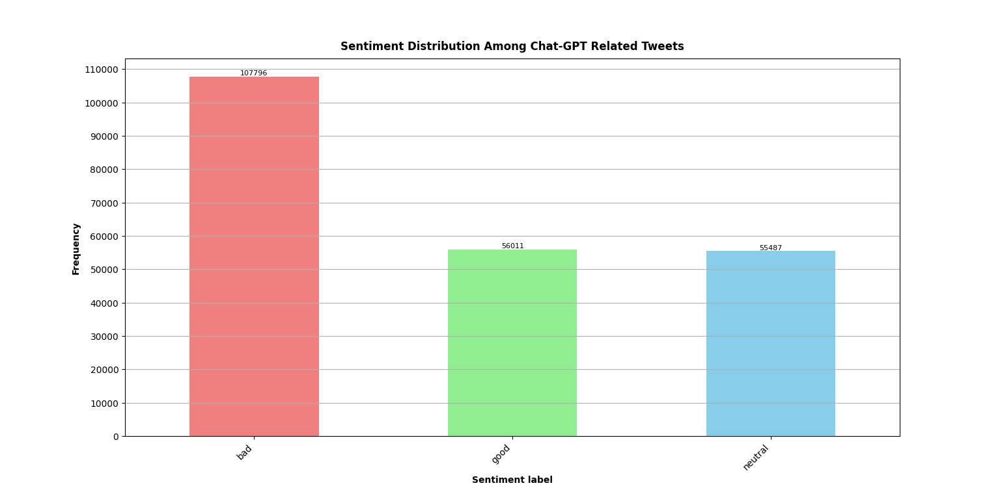
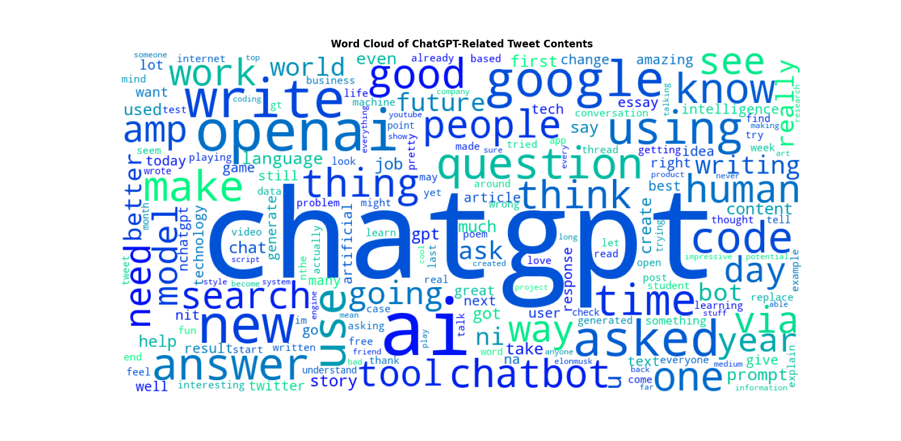

# ChatGPT Twitter Sentiment Analysis

## Project Overview

This project aims to perform a sentiment analysis on a dataset of tweets related to OpenAI's Large Language Model, ChatGPT. The analysis involves natural language processing (NLP) techniques, including data loading, text preprocessing, exploratory data analysis (EDA), and the development of a multinomial naive Bayes machine learning model for sentiment prediction.

## Project Components

1. **Data Loading**  
   The project begins by loading data for 217,622 tweets from a CSV file into a pandas DataFrame using the `load_data` function. The loaded dataset includes three columns: 'index' containing the sequential identifiers of each tweet instance, 'tweets' containing the raw tweet text and 'labels' containing the respective sentiment of each tweet's content ('good', 'bad', 'neutral').

2. **Text Preprocessing**  
   The `preprocess_text` function is implemented to clean and preprocess the tweet text. This includes converting text to lowercase, removing URLs, emojis, hashtags, non-alphanumeric characters, and stop words. Additionally, words are lemmatised to reduce them to their root form, enhancing the quality of the processed text data.

3. **Exploratory Data Analysis (EDA)**  
   EDA is conducted through two visualisation functions: `plot_sentiment_freq` and `generate_word_cloud`.
   - `plot_sentiment_freq` generates a bar plot displaying the distribution of sentiment labels in the dataset. This provides insights into the balance of different sentiment classes.
   - `generate_word_cloud` creates a word cloud based on the processed tweet data, visually representing the most frequent words. This offers an intuitive understanding of the prominent terms within the dataset.

4. **Machine Learning Model**  
   A Multinomial Naive Bayes model is implemented using scikit-learn to predict sentiment labels. The `fit_model` function tokenises and vectorises the processed tweet data, splits the data into training and testing sets, and fits the model. The accuracy, confusion matrix, and classification report are then displayed.

## Project Results

### Sentiment Frequency Analysis

The observation of an imbalanced distribution in the sentiment frequency histogram is noteworthy. The prevalence of 'bad' tweets surpassing 'good' and 'neutral' tweets suggests a potential skew in public sentiment within the sampled tweets. While this could be a reflection of the natural trend in public sentiment, it is essential to recognise that imbalances might introduce biases, impacting the model's generalisation ability. Therefore, acknowledging this imbalance becomes crucial for a nuanced interpretation of the model's performance.



### Word Cloud Insights

The word cloud analysis reveals significant terms recurrent in ChatGPT-related tweets, offering valuable insights into public sentiment and prevailing topics. The meaningful terms and words captured here also indicate the successful preprocessing of the raw tweet data.



The prominence of terms like 'chatgpt', 'ai', 'openai', 'good', 'people', and 'chatbot' suggests several key aspects:

1. **Positive Associations:** The presence of terms like 'good' and 'people' may indicate a positive sentiment or favourable experiences shared by users. This could signify a positive user reception towards ChatGPT.

2. **Technology and Innovation:** Terms such as 'ai' and 'openai' highlight the technological aspect of the discussions. Users appear to engage in conversations centred around artificial intelligence, emphasising the significance of technological innovation.

3. **User Engagement:** The repetition of terms like 'chatgpt' and 'chatbot' suggests a focus on conversational aspects, indicating user engagement and interest in ChatGPT's conversational capabilities.

4. **Diverse Applications:** The inclusion of terms like 'openai' and 'people' hints at the diverse applications and impacts of ChatGPT, extending beyond technical discussions to broader societal contexts.

Understanding these key terms provides a qualitative lens through which to interpret public sentiment. These insights not only aid in comprehending user perceptions but also contribute to refining the sentiment analysis model, ensuring it captures the nuances and dynamics within the ChatGPT-related discourse on Twitter.

### Model Performance

The Multinomial Naive Bayes model achieves an accuracy of approximately 74%. The confusion matrix and classification report output by the main script further detail the model's performance across different sentiment classes. Precision, recall, and F1-score metrics contribute to a comprehensive evaluation of the model's predictive capabilities.

```
Accuracy: 0.7375681160081169

Confusion Matrix:
 [[18809  1091  1430]
 [  566  9042  1676]
 [ 2885  3862  4498]]

Classification Report:
               precision    recall  f1-score   support

         bad       0.84      0.88      0.86     21330
        good       0.65      0.80      0.72     11284
     neutral       0.59      0.40      0.48     11245

    accuracy                           0.74     43859
   macro avg       0.69      0.69      0.69     43859
weighted avg       0.73      0.74      0.73     43859
```

## Project Implications

- **Dataset Characteristics:** Understanding the imbalanced nature of the dataset is crucial for interpreting the model's performance. Consideration should be given to potential biases introduced by the dataset's composition.

- **Word Cloud Insights:** The word cloud analysis unveils significant terms recurrent in ChatGPT-related tweets, offering valuable insights into public sentiment and prevailing topics.

  - **Positive Associations:** The presence of terms like 'good' and 'people' may indicate a positive sentiment or favourable experiences shared by users. This could signify a positive user reception towards ChatGPT.

  - **Technology and Innovation:** Terms such as 'ai' and 'openai' highlight the technological aspect of the discussions. Users appear to engage in conversations centred around artificial intelligence, emphasising the significance of technological innovation.

  - **User Engagement:** The repetition of terms like 'chatgpt' and 'chatbot' suggests a focus on conversational aspects, indicating user engagement and interest in ChatGPT's conversational capabilities.

  - **Diverse Applications:** The inclusion of terms like 'openai' and 'people' hints at the diverse applications and impacts of ChatGPT, extending beyond technical discussions to broader societal contexts.

Understanding these key terms provides a qualitative lens through which to interpret public sentiment. These insights not only aid in comprehending user perceptions but also contribute to refining the sentiment analysis model, ensuring it captures the nuances and dynamics within the ChatGPT-related discourse on Twitter.

- **Model Performance:** The machine learning model's accuracy of 74% indicates a reasonable predictive capability. Further optimisations, such as hyperparameter tuning or experimenting with different models, could potentially enhance performance.

## Future Work

- **Balancing the Dataset:** Addressing the dataset's imbalance could lead to improvements in model performance. Techniques such as oversampling, undersampling, or generating synthetic samples may be explored.

- **Advanced NLP Techniques:** Experimenting with advanced NLP techniques, such as deep learning models like BERT or GPT, could potentially capture more complex relationships within the text data.

- **User Interaction Analysis:** Analysing user interactions, engagement metrics, or sentiment changes over time could provide deeper insights into the evolving perception of ChatGPT.

## Conclusion

The ChatGPT Twitter Sentiment Analysis project offers a practical tool for those interested in sentiment analysis and NLP. Examining sentiments in ChatGPT-related tweets, the analysis reveals an imbalance in sentiment classes, with a higher frequency of 'bad' tweets. While the Multinomial Naive Bayes model achieves a 74% accuracy, its performance varies across sentiment categories. Precision, recall, and F1-score metrics provide insights.

The word cloud analysis highlights key terms like 'chatgpt,' 'ai,' 'openai,' 'good,' and 'people,' shedding light on user sentiments. These findings suggest potential positive associations, technological discussions, and user engagement.

This project provides a practical foundation for refining sentiment analysis models. Addressing dataset imbalances and exploring advanced NLP techniques could enhance the model's effectiveness in discerning sentiments, offering valuable insights into user perceptions of ChatGPT and similar AI technologies.
